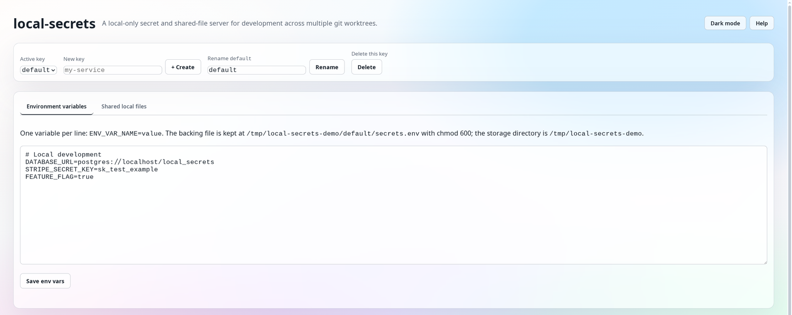

# local-secrets

`local-secrets` is a tiny local-only Axum server for sharing development secrets and untracked local files across multiple git worktrees, organised by **key** (namespace).

It removes the need for per-worktree files such as `.env.local`, `.npmrc`, or service-account JSON files in the repository directory. The server stores them once under your user config directory, grouped by key, and exposes them over `127.0.0.1` for local development workflows.



A `default` key is created on first start. Use the dropdown in the UI to switch between keys, and the create/rename/delete forms to manage them.

There is intentionally no authentication. Run it only on a machine you control, and keep it bound to loopback unless you understand the risk.

## Install

This project is not published to crates.io. Install from the GitHub repository or from the prebuilt GitHub Release assets.

### Prebuilt binary with `cargo binstall`

`cargo binstall` reads this repository's `Cargo.toml`, then downloads the matching archive from the GitHub Release for the current package version.

```sh
cargo install cargo-binstall
cargo binstall --git https://github.com/cjrh/local-secrets.git local-secrets
```

Release archives are attached for:

- `x86_64-unknown-linux-gnu`
- `x86_64-pc-windows-msvc`
- `x86_64-apple-darwin`
- `aarch64-apple-darwin`

### Build from source with `cargo install`

Install the current default branch:

```sh
cargo install --locked --git https://github.com/cjrh/local-secrets.git local-secrets
```

Or install an exact release tag:

```sh
cargo install --locked --git https://github.com/cjrh/local-secrets.git --tag v0.3.0 local-secrets
```

## Run

```sh
local-secrets
```

For local development from a checkout:

```sh
cargo run
```

By default the server listens on:

```text
http://127.0.0.1:37997
```

Open the configuration UI:

```text
http://127.0.0.1:37997/keys/default
```

The storage directory defaults to the idiomatic config directory for your OS, e.g. on Linux:

```text
~/.config/local-secrets/
```

Inside, each key is a subdirectory:

```text
~/.config/local-secrets/
  default/
    secrets.env
    files/
  another-key/
    secrets.env
    files/
```

`local-secrets` enforces private permissions for stored data:

- storage directory: `0700`
- per-key env and shared files: `0600`

Options:

```sh
local-secrets --bind 127.0.0.1:37997 --data-dir ~/.config/local-secrets
```

## Configure secrets

Open the UI, pick a key from the dropdown, and click **Unlock** before editing. Secret values are hidden while locked to reduce accidental disclosure during screen sharing; the editor automatically locks again 30 seconds after the last edit.

Enter values in dotenv-compatible `NAME=value` form:

```env
DATABASE_URL=postgres://localhost/my-app
STRIPE_SECRET_KEY=sk_test_...
FEATURE_FLAG=true
```

Use the form buttons to create, rename, or delete a key.

The parser is deliberately small and portable:

- blank lines and whole-line `#` comments are allowed in the editable backing file
- comments and blank lines are removed when secrets are served from `/api/keys/{key}/env-file`
- names must match normal environment-variable names (`[A-Za-z_][A-Za-z0-9_]*`)
- values are literal text after the first `=`
- no quote removal, shell expansion, or inline-comment parsing is performed

## API

```sh
# Keys
curl -fsS http://127.0.0.1:37997/api/keys
curl -fsS -X POST -H 'Content-Type: application/json' -d '{"name":"my-service"}' http://127.0.0.1:37997/api/keys
curl -fsS -X PATCH -H 'Content-Type: application/json' -d '{"new_name":"other"}' http://127.0.0.1:37997/api/keys/my-service
curl -fsS -X DELETE http://127.0.0.1:37997/api/keys/my-service

# Per-key env
curl -fsS http://127.0.0.1:37997/api/keys/default/env-file
curl -fsS http://127.0.0.1:37997/api/keys/default/env
curl -fsS http://127.0.0.1:37997/api/keys/default/export
curl -fsS http://127.0.0.1:37997/api/keys/default/export/fish
curl --data-binary @.env.local -X PUT http://127.0.0.1:37997/api/keys/default/env-file

# Per-key shared files
curl --data-binary @.npmrc -X PUT http://127.0.0.1:37997/api/keys/default/files/.npmrc
curl -fsS http://127.0.0.1:37997/api/keys/default/files/.npmrc
```

## Docker recipes

The recommended pattern is: keep Dockerfiles free of `local-secrets` references, fetch secrets from the host shell, and pass them through standard Docker interfaces. All examples below assume the active key is `default`; substitute the actual key in the URL.

### Runtime container: `docker run`

No Dockerfile changes are needed.

```sh
docker run --rm \
  --env-file <(curl -fsS http://127.0.0.1:37997/api/keys/default/env-file) \
  your-image:dev
```

This fetches the env file on the host and gives it to Docker as a normal `--env-file`.

### Runtime service: Docker Compose

Use a generic compose variable for the env-file path:

```yaml
services:
  app:
    image: your-image:dev
    env_file:
      - ${DEV_ENV_FILE:?set DEV_ENV_FILE}
```

Then run Compose with process substitution in bash or zsh:

```sh
DEV_ENV_FILE=<(curl -fsS http://127.0.0.1:37997/api/keys/default/env-file) docker compose up
```

For fish, use `psub`:

```fish
env DEV_ENV_FILE=(curl -fsS http://127.0.0.1:37997/api/keys/default/env-file | psub) docker compose up
```

The compose file is not tied to `local-secrets`; any production or CI system can set `DEV_ENV_FILE` to a different env file.

### Build-time non-secret configuration: build args

Docker cannot make host environment values visible during image builds unless the Dockerfile exposes a standard build input. For non-secret config, use ordinary Docker build args. The Dockerfile stays generic:

```dockerfile
ARG PUBLIC_API_URL
ENV PUBLIC_API_URL=$PUBLIC_API_URL
```

Build with values loaded from `local-secrets` into the host shell:

```sh
eval "$(curl -fsS http://127.0.0.1:37997/api/keys/default/export)"
docker build --build-arg PUBLIC_API_URL -t your-image:dev .
```

For fish, use:

```fish
curl -fsS http://127.0.0.1:37997/api/keys/default/export/fish | source
docker build --build-arg PUBLIC_API_URL -t your-image:dev .
```

Do not use build args for sensitive values; they can leak into image metadata or layers depending on how they are used.

### Build-time secret files: BuildKit secrets

For real secrets needed only during build, use Docker BuildKit secrets. The Dockerfile uses the standard BuildKit secret interface, not `local-secrets`:

```dockerfile
# syntax=docker/dockerfile:1
RUN --mount=type=secret,id=npmrc,target=/root/.npmrc npm ci
```

Pass the secret file from `local-secrets` at build time:

```sh
tmp_npmrc=$(mktemp)
trap 'rm -f "$tmp_npmrc"' EXIT
curl -fsS http://127.0.0.1:37997/api/keys/default/files/.npmrc > "$tmp_npmrc"
DOCKER_BUILDKIT=1 docker build --secret id=npmrc,src="$tmp_npmrc" -t your-image:dev .
```

Production builds can provide the same `id=npmrc` secret from CI or a secret manager.

### Build-time env secrets

If a build tool can only read an environment variable, prefer adapting the build step to read a BuildKit secret file. If that is not possible, use the narrowest generic Docker interface available and avoid persisting the value into an image layer.

The important constraint is unavoidable: a Dockerfile that needs a secret during build must define where the build step expects that secret. `local-secrets` should remain outside the Dockerfile; the Dockerfile should use standard Docker concepts such as `ARG` or BuildKit `--mount=type=secret`.

## Shared local files

You can also store untracked files that are not environment variables:

```sh
curl --data-binary @service-account.json \
  -X PUT http://127.0.0.1:37997/api/keys/default/files/service-account.json
```

Fetch into a temporary file for a local command:

```sh
tmp_file=$(mktemp)
trap 'rm -f "$tmp_file"' EXIT
curl -fsS http://127.0.0.1:37997/api/keys/default/files/service-account.json > "$tmp_file"
GOOGLE_APPLICATION_CREDENTIALS="$tmp_file" cargo test
```

Or pass it to Docker as a BuildKit secret as shown above.

## Releasing

Releases are tag-driven and are not published to crates.io. A pushed `vX.Y.Z` tag starts the GitHub Actions release workflow, which builds Linux, Windows, and macOS archives and attaches them to a GitHub Release.

Install `cargo-release` once:

```sh
cargo install cargo-release
```

Preview a release locally:

```sh
cargo release patch
```

Perform the release:

```sh
cargo release patch --execute
```

`cargo-release` bumps `Cargo.toml`/`Cargo.lock`, commits the version bump, creates a `vX.Y.Z` tag, and pushes the commit and tag. The tag push kicks off `.github/workflows/release.yml`.

## License

`local-secrets` is licensed under the GNU General Public License version 3 or later (`GPL-3.0-or-later`). See [LICENSE](LICENSE) for the full license text.
